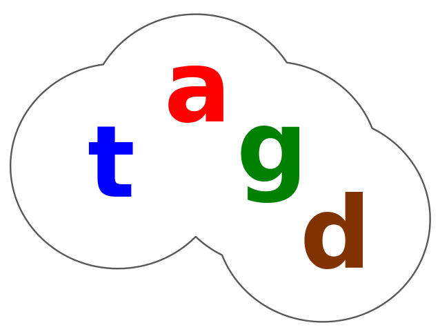

## The tagd Semantic-Relational Engine

[Installation](#installation) instructions are at the end of this document.

The tagd software is composed of
* semantic entities called **tags**
* a semantic-relational database called **tagdb**
* the **TAGL** language and interpreter
* a **tagsh** shell
* and the **httagd** web service

*intelligent agents* (human or machine) can define and retrieve the semantic
meaning of tags through a meta-conceptual language called **TAGL**.

By defining *subordinate relations*, *tagdb* organizes a tree of knowledge
called a **tagspace**.  TAGL maps to a *tagspace*. The *httagd* web service
in turn maps to *TAGL*, enabling communication over the Web and
integration with other services.

All tokens in TAGL are **UTF-8** labels.

### TAGL Tutorial

This tutorial is intended to be read through, or followed by performing the
actions.

To perform the actions, first make the software (see [Installation](#installation)),
then launch **tagsh** - the tagd shell:

	cd tagsh
	bin/tagsh --db -

The `--db -` option tells tagsh to create a sqlite in-memory database.
`tagsh -h` shows usage and options.

#### PUT Statement

A tag can be a metaphysical concept or a concrete entity.  It can be anything
you can think of and put into words.  To define a tag, you must define its
*sub relation*, given by `_sub`, `_is_a`, or `_type_of`:

	>> dog _is_a mammal;

Whoah, we have an error:

	TAGL_ERR _type_of _error
	_caused_by _unknown_tag = mammal

The object (mammal in this case) of a sub relation must also be defined. This
requires a bit of abstract metaphysical thinking, but here we go:

	>> physical_object _is_a _entity;
	>> living_thing _is_a physical_object;
	>> animal _is_a living_thing;
	>> vertibrate _is_a animal;
	>> mammal _is_a vertibrate;
	>> dog _is_a mammal;

The `>>` is the input operator for putting data.  Note the predicate
`_is_a _entity`.  Tags with a leading underscore ('\_') are known as
**hard tags**, that is, they are hard-coded in the software, defined for you, and
cannot be redefined.  User defined tags with a leading underscore are illegal.
The `_entity` tag is the root of the tagspace - it does not get more
abtract than that.

Whereas, *SQL* uses *table schemas* to define entities and relations,
*TAGL* uses semantic relations to define entities.

The `_entity` tag is axiomatic and self-referencing (i.e. `_entity _sub _entity`).
It is the only tag having this relation. It is the *root* of a tagspace (tree structure).

Now let's put some more tags so that we can define dog more completely:

	>> can _type_of _rel;
	>> event _is_a _entity;
	>> sound _type_of event;
	>> utterance _type_of sound;
	>> bark _type_of utterance;
	>> body_part _type_of physical_object;
	>> legs _type_of body_part;
	>> tail _type_of body_part

	>> dog
	can bark
	_has legs = 4, tail;

Note the missing semicolon (';') after the statement `>> tail _type_of body_part`.
That's not a syntax error.  A statement can be terminated by a semicolon,
`<EOF>`, or a double newline.

The equal sign (`=`) after `legs` indicates that the `4` is a **modifier**.
In this case, more specifically, as a number, it becomes a **quantifier**,
that is, it quantifies the object.  Modifiers are optional, but if present,
they must be preceded by an equal sign.

The intent of a modifier is to assign values to objects when appropriate.
You can think of objects and modifiers as *key/value pairs* that are *attributes*
of a tag.

Note, when speaking of subjects and objects, this is meant in the linguistic
sense of the terms (i.e. subject-verb-object). Also, we tend to use the terms
*relations* and *predicates* interchangeably.

Now is a good time to define a input (`>>`) statement more formally...

##### PUT Grammar:

	put_statement ::= ">>" subject_sub_relation relations
	put_statement ::= ">>" subject_sub_relation
	put_statement ::= ">>" subject relations

	subject_sub_relation ::= subject SUB TAG

	subject ::= TAG

	relations ::= relations predicate_list
	relations ::= predicate_list

	predicate_list ::= relator object_list

	relator ::= TAG

	object_list ::= object_list ',' object
	object_list ::= object

	object ::= TAG EQUALS QUANTIFIER
	object ::= TAG EQUALS MODIFIER
	object ::= TAG EQUALS QUOTED_STR
	object ::= TAG

Where `TAG` and `MODIFIER` are UTF-8 labels composed of alphanumeric characters and
underscores and a `QUANTIFIER` is a number. A modifier can hold spaces and other
special characters if it is enclosed in double quotes.  Double quotes as part
of the modifier value must be escaped (i.e. `"my \"quoted\" modifier"`).
The `SUB TAG` predicate defines the subject as being subordinate to
(i.e. "is a" or child relation) another tag.

##### Comments:

Comments can be used in TAGL like this:

	-- this is a comment until the end of line
	-* this is a block comment *-

#### GET Statement

Now we can get the tag we've defined:

	<< dog;

Results should be:

	dog _is_a mammal
	can bark
	_has legs = 4, tail

##### GET Grammar:

	get_statement ::= "<<" subject

As you can see, the `<<` output operator is used for getting data.
The definition will likely be expanded to allow for getting subject lists
of more than one tag in the future.

#### DELETE Statement

Let's set up a nonsense tag and delete it:

	>> fangs _type_of body_part;

	>> turtle _is_a mammal
	_has legs, fangs;

To delete a particular relation, use the `!!` operator:

	!! turtle _has fangs;

Now the tag will still exist, but the relation will have been deleted:

	<< turtle;

Results should be:

	turtle _is_a mammal
	_has legs

But a turtle is not a mammal, so let's delete it:

	!! turtle;

And it should no longer exist:

	<< turtle;

	TS_NOT_FOUND _type_of _error
	_caused_by _unknown_tag = turtle

##### DELETE Grammar:

A `DELETE` statement has the same grammar as a PUT statement, except that it
cannot have a sub relation.

#### QUERY Statement

Tags (subjects) can be retrieved according to matching predicates using query
statements.  Let's define some more tags to make it interesting:

	>> lives_in _type_of _rel;
	>> substance _is_a _entity;
	>> fluid _type_of substance;
	>> water _type_of fluid;
	>> gas _is_a substance;
	>> air _type_of gas;
	>> body_fluid _is_a substance;
	>> blood _type_of body_fluid;
	>> fins _type_of body_part;
	>> gills _type_of body_part;
	>> hair _type_of body_part;
	>> scales _type_of body_part;
	>> breathes _is_a _rel;
	>> what _is_a _interrogator;

	>> fish _type_of vertibrate
	_has gills, fins, scales
	lives_in water
	breathes water

	>> mammal
	_has hair, blood = warm
	breathes air

	>> whale _is_a mammal
	_has fins
	lives_in water;

Now let's try a query:

	?? what _is_a animal
	lives_in water;

Results should be:

	whale, fish

The `_interrogator` tag is optional, the following statements are synonymous:

	?? _interrogator _is_a animal lives_in water;
	?? _is_a animal lives_in water;

But `whale _is_a mammal` and `fish _is_a vertibrate` - how did we query for
`_is_a animal` and get a match?  Since tagspace is organized as a tree, and
animal is a parent (being *superordinate* or a *hypernym*) of both vertibrate
and mammal, we can logically deduce that whale and fish match.

Let's try another:

	?? what lives_in water
	breathes air
	_has fins, blood = warm;

Results should be:

	whale

###### Wildcard Relator:

	?? what * water, fins, blood = warm;

Results should be:

	whale

The wildcard ('\*') means "is related to" in the most general sense.  It allows
you to match objects while leaving out relators.

##### Full Text Search

The simplest full text query is the query operator followed by a quoted string:

	?? "has fins"

Results should be:

	whale ,
	fish

You can add search terms to an interrogator to combine with other predicates:

	?? _what
	_has blood = warm ,
	    _terms = "has fins";

Results:

	whale

##### QUERY Grammar:

	query_statement ::= "??" interrogator_sub_relation relations
	query_statement ::= "??" interrogator_sub_relation
	query_statement ::= "??" interrogator query_relations
	query_statement ::= "??" "<search terms>"

	query_relations ::= relations
	query_relations ::= relator HARD_TAG_TERMS = "<search terms>"

	interrogator_sub_relation ::= interrogator SUB TAG

	interrogator ::= INTERROGATOR
	interrogator ::= ""

#### URLs

URLs are recognized and parsed in TAGL with no special syntax required.  Unlike
other tags, URLs cannot currently be assigned a sub relation.  A sub relation
`_is_a _url` is assigned for you when putting a URL.  This will likely change
in the future so that tags "referenced by url" can be defined (e.g. "wiki").

Let's put some urls:

	>> about _type_of _rel

	>> https://en.wikipedia.org/wiki/Dog
	about dog

	>> http://animal.discovery.com/breed-selector/dog-breeds.html
	about dog

	>> https://en.wikipedia.org/wiki/Whale
	about whale;

Now we can query some URLs:

	?? what _is_a _url
	about dog;

Results:

	https://en.wikipedia.org/wiki/Dog,
	http://animal.discovery.com/breed-selector/dog-breeds.html

And some more:

	?? what * _private = wikipedia,
	_public = org
	about animal;

Results:

	https://en.wikipedia.org/wiki/Dog,
	https://en.wikipedia.org/wiki/Whale

Now let's get a url:

	<< https://en.wikipedia.org/wiki/Dog ;

Results:

	https://en.wikipedia.org/wiki/Dog _is_a _url
	_has _host = en.wikipedia.org, _path = /wiki/Dog, _private = wikipedia, _public = org, _scheme = https, _subdomain = en
	about dog

As you can see, when a URL is inserted, it is parsed and its components
are inserted according to the following hard tags:

* `_url` - sub tag for URLs
* `_url_part` - the sub tag of url part hard tags
	* `_host` - host of a URL
	* `_private` - private label of a registerable TLD
	  (i.e. the "wikipedia" in wikipedia.org)
	* `_public` - label(s) of the TLD (can be a multi-level TLD).
	  Public and private (effective) TLDs are parsed according to the
	  [Mozilla Public Suffix List](http://publicsuffix.org/)
	* `_subdomain` - subdomain label(s)
	* `_path`
	* `_query` - query string of the URL
	* `_fragment`
	* `_port`
	* `_user`
	* `_pass`
	* `_scheme`

#### Referents and Contexts

TAGL uses referents and contexts as a way of dealing with different names that refer to the
same thing (i.e. synonyms), and different things referred by the same name (i.e. ambiguity).
A *NULL* context is known as the **Universal Context**.

#### Referent Statement:

A context is required in a referent statement. However, a referent alias in the
**Universal Context** is illegal:

	>> is_a _refers_to _is_a;
	TAGL_ERR _type_of _error
	_caused_by _context = NULL

First, let's create a relevant context `simple_english`:

	>> communication _is_a _entity;
	>> language _type_of communication;
	>> simple_english _type_of language;

If you would like to alias hard tags, you can do so:

	>> is_a _refers_to _is_a _context simple_english;
	>> has _refers_to _has _context simple_english;

To use a context in statments globally, we must first `SET` it:

	%% _context simple_english;

	-- _context simple_english appended
	>> context _refers_to _context;
	-- same as
	-- context _refers_to _context _context simple_english;
	>> refers _refers_to _refers;

We can even alias `_refers_to`:

	>> refers_to _refers_to _refers_to;

Here is a synonym for animal:

	-- refers_to (in the simple_english context) will be decoded as _refers_to
	>> creature refers_to animal;

Now, we can `<< animal` by refering to creature:

	-- refers_to (in the simple_english context) will be decoded as _refers_to
	<< creature;

Results:

	creature is_a living_thing
	refers_to animal

Here are some more referents within the `simple_english` context:

	>> plant is_a living_thing;
	>> fruit is_a plant;
	>> citrus is_a fruit;
	>> lemon is_a citrus;

	>> quality is_a _entity;
	>> color is_a quality;
	>> yellow is_a color;

	>> machine is_a physical_object;
	>> automobile is_a machine;
	>> used_car is_a automobile;

	>> lemon refers_to yellow context color; -- overrides context simple_english
	>> lemon refers_to used_car context automobile;

Now, let's get lemon in the `simple_english` context:

	<< lemon;

Results:

	lemon is_a citrus;

No surprises - now let's set a different context...

#### SET Statement:

	%% _context automobile;
	<< lemon;

Results:

	lemon is_a automobile
	refers_to used_car

Context heirarchies can also be set, where the closest context (from right to left)
is tested for a match before moving up the context list:

	%% context automobile, color;
	<< lemon;

Results:

	lemon is_a color
	refers_to yellow

Example of a Japanese referent:

	%% _context simple_english;
	>> japanese is_a language;
	>> イヌ refers_to dog context japanese;

First, here is a gotcha:

	<< イヌ;

Results:

	TS_AMBIGUOUS _type_of _error
	_has _message = "イヌ refers to a tag with no matching context"

Though there is currently only one referent of "イヌ", its not safe to resolve
it in the universal context, as one could later define another referent of the
same label and alter program logic, as it then truly would be ambiguous.

If a referent is defined in a context, that context must be set to resolve it:

	%% context japanese;
	<< イヌ;

Results:

	イヌ _is_a mammal
	_can bark
	_has legs = 4, tail
	_refers_to dog

A nested context stack will resolve heirachically:

	%% context simple_english, japanese;
	<< イヌ;

Results:

	イヌ is_a mammal
	can bark
	has legs = 4, tail
	refers_to dog

The context can be cleared by setting it to an empty string:

	%% context "";

##### QUERY Referents:

You can see what a label *refers* by using a query:

	?? _what _refers lemon;

Results:

	lemon _refers_to used_car
	_context automobile

	lemon _refers_to yellow
	_context color

And with a context:

You can see what a label *refers* by using a query:

	?? _what _refers lemon _context machine;

Results:

	lemon _refers_to used_car
	_context automobile

Likewise, you can query what *refers to* a tag:

	?? _what _refers_to dog;

Results:

	イヌ _refers_to dog
	_context japanese

Or, you can query all referents given a context:

	>> クジラ _refers_to whale _context japanese;

-*
-- TODO use a wildcard that would return the same results for _refers or _refers_to
	?? _what _refers * _context japanese
-- or
	?? _what _refers_to * _context japanese
*-
	?? _what _context japanese;

Results:

	イヌ _refers_to dog
	_context japanese

	クジラ _refers_to whale
	_context japanese

Finally, you can query all referents:

	?? _what is_a _referent;

Results:

	creature _refers_to animal

	lemon _refers_to used_car
	_context automobile

	lemon _refers_to yellow
	_context color

	イヌ _refers_to dog
	_context japanese

	クジラ _refers_to whale
	_context japanese

Through the use of referents, we can state predicates in other languages, and
have those predicates immediately available in the context they refer to.

###### Spanish Language Example:

As explained earlier, refereents will be resolved according to a contex stack in
heirarchical order (from right to left), the right most context being the top of the stack.
When a context stack is `SET`, `PUT` statements that omit a `_context` predicate will have
a `_context` predicate appended to the statement using the top of the stack.

Let's set up referents that will allow us to express the definition of dog in
Spanish:

	>> spanish _is_a language;
	%% _context simple_english, spanish;

	-- perro inserted context spanish
	>> perro _refers_to dog;
	-- equivalent to
	-- >> perro _refers_to dog _context spanish;

	-*
	 * Below, es_un is inserted in context spanish.
	 * When resolving refers_to and is_a, first spanish is checked
	 * (context stack right to left), then simple_english.
	 *-
	>> es_un refers_to is_a;
	>> mamífero refers_to mammal;
	>> puede refers_to can;
	>> ladrar refers_to bark;
	>> tiene refers_to has;
	>> patas refers_to legs;
	>> cola refers_to tail;

	>> fur is_a body_part _context simple_english; -- overrides context spanish
	>> pelo refers_to fur; -- back to global context spanish

Now let's add a predicate in Spanish:

	>> perro tiene pelo;

Now we can see the predicate that was stated in Spanish:

	%% context simple_english;
	<< dog;

Results:

	dog is_a mammal
	can bark
	has fur, legs = 4, tail

We can see the `spanish` predicate `tiene pelo` is available in `simple_english` as
`has fur`.

Let's dump all the data we have entered so far to file so we can reuse it:

	.dump /tmp/tutorial.tagl

To exit the shell type `.exit` or `^D`.

### tagd Web Service

Just as TAGL is a map onto a tagspace, the tagd web service (*httagd*) maps
a *tagdurl* to TAGL.  With tagdurls, the *service is the language*.

The httagd web server is very minimal at this point - only a few features have been
implemented, but here goes...

First, fire up the webserver:

	# assuming you are still in the tagsh/ directory
	cd ../httagd
	bin/httagd --db - &

httagd should now be listening on port 2112 and using an in-memory database.

You can post valid TAGL to httagd. Let's load the data we just dumped previously:

	curl -XPOST http://localhost:2112/ --data-binary @/tmp/tutorial.tagl

Note, though the .tagl file is UTF-8 text data, the --data-binary option
prevents curl from messing with the new line characters.

Let's put some data:

	curl -XPUT http://localhost:2112/meow --data '_is_a utterance'
	curl -XPUT http://localhost:2112/cat --data '_is_a mammal _can meow _has legs = 4, tail'

Which executes the TAGL statements:

	>> meow _is_a utterance

	>> cat _is_a mammal
	_can meow
	_has legs = 4, tail

Note, the subject is in the tagdurl, while the relations are in the data body.

Now, let's get it:

	curl -XGET http://localhost:2112/cat

Results:

	cat _is_a mammal
	_can meow
	_has legs = 4, tail

Likewise the following TAGL statement was generated:

	<< cat

We can also provide a context

	curl -XGET http://localhost:2112/cat?c=simple_english

Results:

	cat is_a mammal
	can meow
	has legs = 4, tail

The TAGL generated:

	<< cat _context simple_english

Note, there was no trailing '/' after cat in the previous tagdurls representing `GET`
statements.
A slash after the subject indicates a query.  For example, see the difference between:

	curl -XGET http://localhost:2112/mammal

Results:

	mammal _is_a vertibrate
	breathes air
	has blood = warm, hair

and the query:

	curl -XGET http://localhost:2112/mammal/

Results:

	dog, whale, cat

The TAGL query generated was:

	?? _interrogator _sub mammal;

Now, let's query with some relations:

	curl -XGET http://localhost:2112/animal/meow,tail

Results:

	cat

The TAGL query generated was:

	?? _interrogator _sub animal
	* meow, tail

To perform a query not having a sub relation, use a wildcard ('\*'):

	curl -XGET http://localhost:2112/*/fins,hair,air,water

Results:

	whale

The TAGL query generated was:

	?? _interrogator
	* fins, hair, air, water

To add search terms to your query, add a `q=<terms>` parameter to the query string:

	curl -XGET http://localhost:2112/mammal/?q=can+bark

Results:

		dog

The TAGL query generated was:

	?? _interrogator _sub mammal
	_has _terms = "can bark"

To browse your tagspace, fire up your favorite browser and go to
`http://localhost:2112/mammal?t=html`

So far, that is all that httagd can do.  More features will be coming soon...

### Installation

This has been developed and tested on Ubuntu/Linux Mint. I would be happy to hear of
successful builds and tests on other platforms.

##### Dependencies

* Build Essentials
    * GCC C++ Compiler, headers and libraries
    * Make, etc.
* Optional, to recreate gperf header of [Mozilla's Public Suffix List](http://publicsuffix.org/)
	* [gperf](http://www.gnu.org/software/gperf/) to make a hash of TLDs
	* Net::IDN::Encode CPAN module to parse the list
* [re2c](http://re2c) for the lexer/scanner
* [lemon](http://www.hwaci.com/sw/lemon/lemon.html) for the parser
* [readline](https://tiswww.case.edu/php/chet/readline/rltop.html) for the tagd shell
* [SQLite v3](http://www.sqlite.org/) libs and development headers
* [libevent](http://libevent.org/) libs and development headers
* For the httagd http server
	* [libevhtp](https://github.com/Yellow-Camper/libevhtp)
	* [OpenSSL Development Headers](https://www.openssl.org/)
	* [ctemplate](https://github.com/olafvdspek/ctemplate) for html/json templates
* For testing
	* [CxxTest](http://cxxtest.com/) for unit tests
	* [Curl](http://curl.haxx.se/) for testing httagd
	* [Expect](https://core.tcl.tk/expect/index) for interactive testing of tagsh and httagd

###### Install Dependencies on Debian/Ubuntu/Mint

To Build:

	sudo apt install build-essential gperf libnet-idn-encode-perl re2c lemon libreadline-dev libsqlite3-dev libevent-dev libevhtp-dev libssl-dev libctemplate-dev

For Testing:

	sudo apt install cxxtest expect curl

Building and Testing:

    make
    make tests

### License

In the pursuit of Universal love, peace, and harmony, this is free software
committed to the public domain as [CC0](http://creativecommons.org/publicdomain/zero/1.0/).

